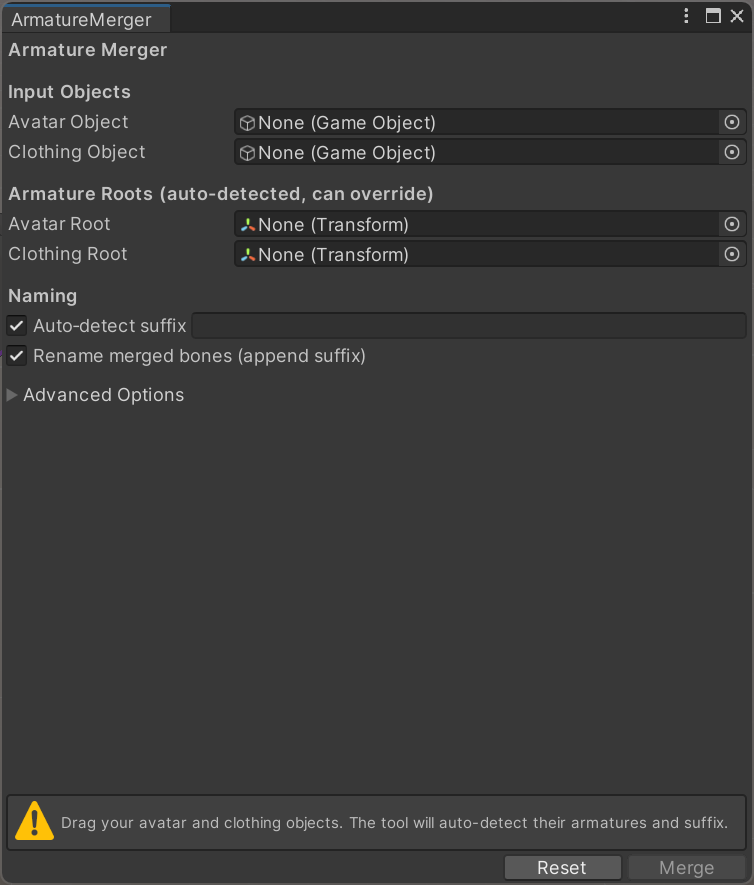

# Armature Merger

## 日本語

このUnityエディタツールは、衣装のボーン階層をアバターのアーマチュアに簡単に統合するためのツールです。  
特に、ModularAvatarなどの最新ツールが動作しない古いUnityバージョン（VSFアバターで使用されるUnity 2019など）で有用です。  
衣装があらかじめアバターに合わせて作られていれば、あらゆる人型アバターで使用できます。  
**VRM 0.X**（UniVRM）での使用を想定しています（VRM 1.Xは未テスト）。

### 機能
- アバターと衣装のオブジェクトをドラッグするだけでアーマチュアルートを自動検出
- 衣装のオブジェクト名からサフィックス（例：`_Cloth`）を自動検出（例：アバター名が「Avatar」、衣装名が「Avatar_Cloth」の場合、「Cloth」を抽出）
- サフィックスの手動入力も可能
- マージ時にボーン名にサフィックスを追加するかどうかを選択可能
- プレハブインスタンスの自動展開（必要に応じて）
- アンドゥ完全対応

### インストール方法

1. Unityの Package Manager ウィンドウを開きます（Window > Package Manager）。
2. 左上の `+` ボタンをクリックし、**"Add package from git URL..."** を選択します。
3. 以下のURLを入力して **Add** をクリックします：  
   `https://github.com/haruyuki/ArmatureMerger.git`

インストール後、Unity上部メニューの **Tools > Armature Merger** からツールを起動できます。

---

## English

This Unity Editor tool helps you merge a clothing armature into an avatar's armature hierarchy with a single click.  
It is particularly useful for older Unity versions (such as Unity 2019 used by VSF avatars) where more feature‑rich tools like ModularAvatar may not be compatible.  
The tool works with any humanoid avatar, provided the clothing armature is already fitted to the avatar.  
**Tested with VRM 0.X** (UniVRM). VRM 1.X has not been tested.

### Features
- Auto‑detects armature roots from avatar and clothing objects
- Auto‑detects a suffix from the clothing object name (e.g., if avatar is "Avatar" and clothing is "Avatar_Cloth", it extracts "Cloth")
- Manual suffix entry when auto‑detection fails
- Option to append the suffix to bone names during merge
- Automatically unpacks prefab instances if needed
- Full Undo support

## Installation / インストール方法

### Unity Package Manager (UPM)
1. Open the Unity Package Manager window (Window > Package Manager).
2. Click the `+` button in the top‑left corner and select **"Add package from git URL..."**.
3. Enter the following URL and click **Add**:  
   `https://github.com/haruyuki/ArmatureMerger.git`

After installation, you will find **Tools > Armature Merger** in the Unity top menu.

---

## Note on Alternatives / 代替ツールについて

**ModularAvatar**や**NDMF**などの最新ツールは高度で非破壊的なアバター改変を可能にしますが、**Unity 2019（VSFアバターで使用）との互換性に制限があります**。  
本ツールはレガシー環境でも使える軽量な代替手段です。ただし、ModularAvatarのような非破壊的手法と異なり、**直接ボーン階層を変更する破壊的な方法**を取っています。

Modern tools like **ModularAvatar** and **NDMF** offer advanced, non‑destructive avatar workflows, but **they may have compatibility limitations with older Unity versions** such as Unity 2019 used by VSF avatars.  
This tool provides a lightweight alternative that works in legacy environments. However, unlike ModularAvatar's non‑destructive approach, it **directly modifies the bone hierarchy (destructive method)**.

---

## Acknowledgements / 謝辞
This tool is inspired by the *Kisekae Bone Setup* created by **ureishi**.  
本ツールは、**ureishi**氏によって公開された*Kisekae Bone Setup*に触発されています。